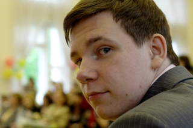

# title: Конвертация Raw в Linux Ubuntu
# url: raw-conversion-in-ubuntu
# categories: [Ubuntu, Фото]
# tags: [Raw]
# time: 2009-01-21 17:48:39

Вот я наконец и дошел до самого интересного, до обработки Raw в Linux Ubuntu. Я думаю многие любители сталкивались с этим вопросами и не могли найти дельные ответы - чем мне заменить Adobe camera raw, LightRoom, Capture One, и многие другие. Существуют обзоры, но их критерии - это описание возможности программы и нравиться или не нравиться. Я же собираюсь попробовать провести не только субъективную оценку, но и сравнить сами снимки.

[more]

### Немного теории
Вообще что такое Raw? Для чего он нужен? Для того что бы понять это, надо немного углубиться камеростроение.
Матрица цифровых фотоаппаратов состоит из светочувствительных элементов. Их всего три, но они расположены в хитром порядке:

Как вы уже поняли разработал эту систему доктор Брайс Э. Байер из компании Kodak. Чесно - "гуано" ещё то, куча отрицательных моментов, но пока ничего лучше не придумали.
Два пиксела закрыты зелеными фильтрами, так как человеческий глаз наиболее чувствителен к зеленому цвету. Поскольку в цветном изображении каждый пиксель имеет три цветовых составляющих (RGB - красный, зеленый и синий), при съемке недостающие компоненты рассчитываются на основе соседних пикселов соответствующих цветов. Процесс этот называется интерполяцией. Существуют разные методы интерполяции, обычно более простые применяются в камерах, поскольку их вычислительные мощности малы. Соответственно обработка на компьютере является более качественной.

RAW-файл (от англ. "сырой") - это данные, которые снимаются  с матрицы фотоаппарата. Фактически это значения уровня сигнала на каждом пикселе, дополнительная техническая информация и конечно EXIF (Для не знающих, это информация о  настройке камеры и параметрах съемки). Данный формат можно сравнить с негативом в пленочной фотографии.

Теперь самое время сказать о преимуществах и недостатках этого формата:

 * \+ Запас информации. Jpg - 8bit против 12, 14bit в Raw. Этот запас выдает примерно +\- 1.5 ступени экспозиции, без потери деталей.
 * \+ Можно выставлять баланс белого, а так же шарпить, и многое другое, опять таки без ощутимых потерь в качестве.
 * \- Большие размеры файла.
 * \- Необходимость конвертировать, а это занимает не мало времени.
 * \- Малая часть вьюверов поддерживает этот формат, а те кто поддерживают, то обычно корявят цвета и экспозицию.

Некоторые профи конвертируют Raw в 16 битный Tif, что бы потом произвести "тонкую" коррекцию в PhotoShop. Но на сколько я знаю Gimp 16 бит не поддерживает.

Можно сказать, что Raw это формат для хранения файлов. Но к слову "Raw" это обшее название: cr2 - Canon, nef - Nikon, dng - Adobe, и др. _И может такое случится, ваш формат со временем перестанут поддерживать..._ Я вот например всегда фотографирую в Raw, поскольку у моей камеры не такая хорошая автоматика, а самому не всегда получается выправить недочет на месте. Но при этом я храню в Raw только лучшие снимки.

### Немного истории
Я хотел бы рассказать немного о Canon EOS 300D. Это зеркальная камера появилась 30 Августа 2003 года. Вроде бы ничем не примечательный аппарат, но.. Но это первая зеркалка, которая стоила МЕНЬШЕ 1000 долларов! Можно сказать она и дала жизнь зеркалкам начального уровня - для любителей. Это я все клоню к тому, что обработка Raw не так уж и давно вошла в повседневную жизнь, а точнее в Windous. Таким образом не стоит ждать великих свершений от Linux...

### Критерии оценки
Главным критерием оценки конечно же станет снимок или два (точнее несколько, но я выложу только один, да простят мне эту лень читатели :-) ). Все познается в сравнении. И будет это портрет. Почему именно он? Да потому что на нем проще всего оценить цветопередачу и другие параметры. Оказалось найти подходящию фотку сложно... Canon 350d + мой любимый 50.1.8: 1/60, f:2.8, 800 iso,+1/3EV. Сравнивал я со стандартным Canon Raw Image Task (RIT). На мой взгляд у него самая нитральная цветопередача, максимально приближенная к камерной, и обработка. Сначала я просто отконвертирую фото и сравню. Потом попробую произвести коррекцию и опять сравнить.
Мощность конвертера я решил не "терзать". Потому что и платные windous решения порой не так хороши.

### dcRaw
[http://cybercom.net/~dcoffin/dcraw/](http://cybercom.net/%7Edcoffin/dcraw/)
Чесно я очень удивился. Оказывается dcRaw это консольная программа с открытыми исходниками. И что не менее интересно, многие программы, такие как UfRaw, Raw Therapee, RawStudio используют ее как базу. Я ее даже не смотрел, и не собираюсь. Для меня концольный конвектор, все равно что просматривать фотки в двоичном коде.

### UFRaw 0.13
[http://ufraw.sourceforge.net/](http://ufraw.sourceforge.net/)
Напоминает Adobe. Имеет неплохой функционал, работает на удивление шустрой под виртуалкой. Отказывается делать 100%, только 50%. Выставляет свои начальные значения, экспозиция аж +0.51! причем очень странно - при выставление 0 дикий недосвет. Есть кривая, можно кадрировать. Есть шумодав, как то он не очень то - больше походит на замазывание, так ещё и работающее не плавно. А вот шарпа нету, что как раз бы хотелось.

### RawStudio 1.0
[http://rawstudio.org/](http://rawstudio.org/)
Я открыл посмотрел на ужасные, серые, поганые цвета, и закрыл "эту радость"...

### Raw therapee 2.4 beta 4
[ttp://www.rawtherapee.com/](http://www.rawtherapee.com/)
Программа стразу удивляет своим функционалом! столько настроек :-) Особенно нравиться история. Шарп агрессивный - я его вообще отключил. Опять таки дикий недосвет, пришлось добавить +0.8. Очень, очень тормознутый, что бы обработать фото необходимо не мало времени, ещё ухудшает то, что default очень далек от реальности (хотя там можно делать свои присеты). В общем производит положительное впечатление.

### Bibble Pro 4.9.8е
[http://bibblelabs.com/](http://bibblelabs.com/)
Сразу скажу это платная программа, стоимостью в районе 130 долларов. Однако не зря просят.. :-) Функционал огромный, все удобно сделано, хотя настроек самой программы нет, странно однако. Ползунки супер! - плавные, что я так люблю в Capture One  3.7.8. Шарп опять жуткий - отключил (я так понимаю у них у всех слоган: не резких фотографий не бывает - бывают недошарпленные!). Зато шумодав меня порадовал, в районах до 5, выдает действительно приятный результат - не какое-нибудь замазывание. Мне даже показалось, что он поднимает субъективную резкость. Камерные настройки отображаются нормально, ничего докручивать не обязательно. Отличная программа.
Я не попробовал версию 5, но насколько я понимаю там ещё  много приятных вещей, сводящие на нет пост обработку.

### LightZone
[http://www.lightcrafts.com/](http://www.lightcrafts.com/)
В поисках я наткнулся на этот конвертер. Я даже сначала подумал, что это Lightroom. Но нет. Функционал достойный, ещё бы ведь просят 200 долларов!, но при этом аппарат тормазнутый. И жутко не понравилось то, что при включении какой-то панели настроек, он автоматически выставляет свои значения. Есть и положительные моменты - картинка радует глаз прямо с default. Тут даже можно выделять отдельные фрагменты и редактировать их, но мне показалось это не таким удобным и практичным. Я бы наверное лучше предпочел что-то на подобии "маски" в фотошоп.

### Фотки

И так, первая партия прямо из конвертера, без обработки. RIT, UFRaw, RawTherapee, Bibble, LightZone

_К огромному моему сожалению, я не смог расположить нормально привьюшки. Но думаю искушённый читатель простит и загрузит их  полном качестве и сравнит в своем любимом вьювере. И конечно же [RAW файл](converted/IMG_9304.CR2)_

_RIT1.jpg_ | [full](~converted/rit1.jpg)

_UFRaw1.jpg_ | [full](~converted/ufraw1.jpg)

_RawTherapee1.jpg_ | [full](~converted/rawtherapee1.jpg)

_Bibble1.jpg_ | [full](~converted/bibble1.jpg)

_LightZone1.jpg_ | [full](~converted/lightzone1.jpg)

И что мы видим? Да все очень  просто, движок dcraw совсем не good. Страдаю цвета, экспозиция.  А вот остальные редакторы выдают очень даже съедобную картинку, bibble только немного с розово-красным переборщил. Что лучше LightZone или RIT? Последний ресует по жесче и конечно любимый Canon розово-красный оттенок (я например его давлю еше при съемке). А если взглянуть с другой стороны, LightZone слегонца зеленит. Вообшем сугубо на любителя.

Партия номер 2, фотки с попыткой улучшить результат.

_RIT2.jpg_ | [full](~converted/rit2.jpg)

_UFRaw1.jpg_ | [full](~converted/ufraw2.jpg)

_RawTherapee2.jpg_ | [full](~converted/rawtherapee2.jpg)

_Bibble2.jpg_ | [full](~converted/bibble2.jpg)

_LightZone2.jpg_ | [full](~converted/lightzone2.jpg)

Как ни бился, ничего нормального из UFRaw и RawTherapee получить не удалось. Bibble показал отличные способности по настройке цвета и я бы сказал выдал лучший результат. LightZone улучшил результат, но можно было бы и лучше, за 200 то гривенных. А RIT, а с ним я просто убрал розовый и все. Просто и со "вкусом".

### Вывод
Моей задачей не было "вылизыванием" фоток до шикарного состояния. Я наоборот старался делать минимальные операции, что бы показать на сколько редактор хорошо сам может понимать камерные настройки и "выжимать" из них максимум. А путем нехитрых манипулирование избавлять фото от некорректных цветов,  и т.д.  Ведь обработка Raw чаше сводиться к пакетной конвертации тысячи снимков, так что времени на каждую должно быть потрачено минимум. Хотя платные пакеты, рассмотренные в данном обзоре, позволяют произвести тонкую обработку.
Из всех редакторов рассмотренных здесь, я бы выбрал Bibble. Он мне понравился больше всего. Удобен, качесвен, полноценен и функционален. А новая версия, думаю, будет ещё лучше.  Хотя конечно сложно сказать, надо поработать месяцок, прогнать фото этак 300... А времени нет. Да и камеры разные все, разные raw следовательно и обработка, и вкусы у людей разные. Так же ничего плохого, кроме скорости :-), не могу сказать о LightZone - тоже отличный инструмент. Но как я думаю вы уже заметили, пакеты эти платные. Все-таки бесплатный сыр только в мышеловки. За все надо платить не "зелеными", так качесвом.

### Мои советы!
Я уже не первый год обрабатываю Raw и смотрел много разных редакторов. В итоге Я выбрал RIT - как наиболее рациональное решение. Если снимки нормальные, то просто пакетно, или немножко подправить. Сильно в нем конечно не разгуляешься, зато и не угробишь! В сложных случаях - Capture. Он шустр и удобен (в отличие от 4 версии).
Совет по Linux, да и windous: не крутите все подряд, а главное шарп! и шумодавы. Они очень агрессивно работают и просто ужасно корявят изображение (а во многих ещё и по умолчанию задраны до небес). Вам потом вряд ли подружка скажет спасибо за такой портрет. Я уже не раз замечал за собой, что увлекаясь "увожу" фото от действительности, это легче чем кажется. Сравнить не с чем, потихоньку двигаешь ползунок, вроде ещё надо, и ещё. А когда уже сравнишь - понимаешь что сделал глупость.
Ещё маленький совтик: не становитесь "задротами", конвертер это прежде всего средство достижение фотки,чуть лучшего качества, а не панацея. Если вы не можете определить что лучше по картинке, то лучше всего будет взять родной редактор, поставляющийся с камерой (Хотя если честно, это для Nikon и Canon. Многие остальные производители пользуются услугами сторонних фирм, типа SilkyPix и т.д. Я не говорю что они плохи, просто они не родные). Там цветовой профиль скорее всего будет наиболее приближенный к реальности.
Или вообще снимать в jpg и радоваться, и не знать проблем! :-)

### Удачных вам снимков!

_Я надеюсь, что я не зря все это писал, и читатели найдут что-то полезное для себя! С удовольствием послушаю конструктивную критику и замечания, если таковые имеются._
